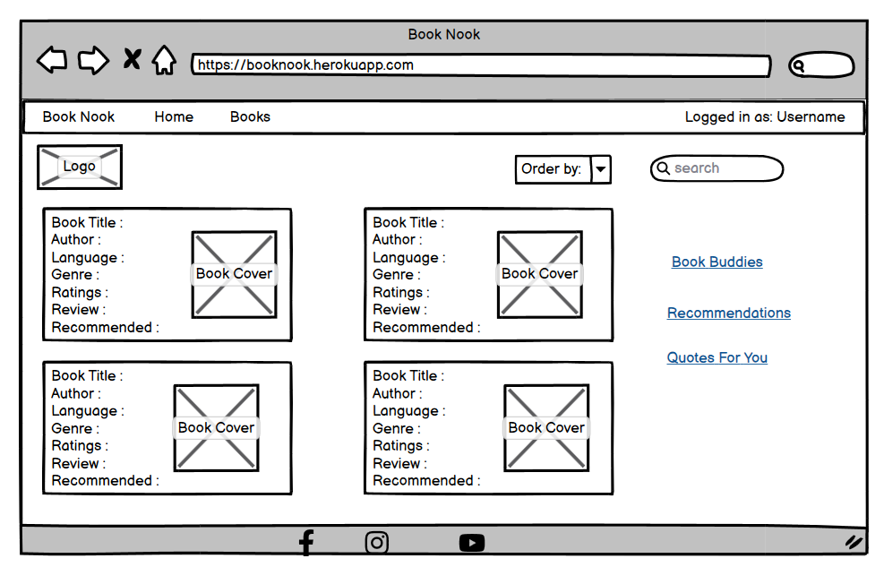

# Book Nook

Book Nook is a cozy and welcoming space for bibliophiles to share their reviews on books they've read with fellow book lovers.
It captures the idea of a community where readers can find refuge and camaraderie through their shared love of literature.

# Table of contents
- [Book Nook](#book-nook)
- [Table of contents](#table-of-contents)
- [UX](#ux)
    - [Site Purpose](#site-purpose)
    - [Site Goal](#site-goal)
    - [Audience](#audience)
    - [User Goal](#user-goal)
- [Design](#design)
    - [Wireframes](#wireframes)
    - [Database Schema - Entity Relationship Diagram](#database-schema-entity-relationship-diagram)
- [Agile Methodologies](#agile-methodologies)
    - [MoSCoW Prioritization](#moscow-prioritization)
    - [User Stories](#user-stories)
- [Languages used](#languages-used)
- [Testing](#testing)
    - [Validator Testing](#validator-testing)
    - [Manual Testing](#manual-testing)
    - [Unfixed Bugs](#unfixed-bugs)
- [Libraries and Packages used](#libraries-and-packages-used)
- [Deployment](#deployment)
    - [How to Fork](#how-to-fork)
- [Credits](#credits)

# UX
### Site Purpose
To provide a platoform for bibliophiles to interact and share their thoughts on their favourite books. It is like a community of readers.
### Site Goal
To provide readers an opportunity to share their reviews, read reviews written by fellow readers, and interact with the community through likes, comments and followers. 

### Audience
Anybody that wants to read and has an interest in books.

### User Goal
Be part of a reader community.

# Design
### Wireframes
I created the wireframes using Balsamiq desktop tool before starting coding. There are some changes between the wireframe designs and the actual implemented designs due to more clarity during the project implemention.

     

     

     

### Database Schema - Entity Relationship Diagram     
Database schema was created using [DrawSQL](https://drawsql.app/). The schema was used to plan the database models and fields. It also helped in displaying the relationships between the models and how they interact. There were some minor changes between the designed database and the implemented one due to more clarity during the project implemention.    

    

# Agile Methodologies    

Book Nook is my second project where I followed Agile planning methods by myself. I had done it for my portfolio project 4 and also participated in Code Institute's March Hackathon. These experiences helped me a lot as I already knew how it works. I used my Github Projects Board to plan and document all of my work. 

### MoSCoW Prioritization    

I followed the MoSCoW Prioritization method for Book Nook project by identifying and labelling my:

- Must Haves: the 'required', critical components of the project. Completing my 'Must Haves' helped me to reach the MVP (Minimum Viable Product) for this project early, allowing me to develop the project further than originally planned.

- Should Haves: the components that are valuable to the project but not absolutely 'vital' at the MVP stage. The 'Must Haves' must receive priority over the 'Should Haves'.

- Could Haves: these are the features that are a 'bonus' to the project, it would be nice to have them in this phase, but only if the most important issues have been completed first and time allows.

- Won't Haves: the features or components that either no longer fit the project's brief or are of very low priority for this release.

### User Stories    

All the user stories have been added to the Project Board with the required fields like title, description, acceptance criteria, tasks, labels, project, milestone etc. The user stories were moved across the board through stages like To Do, In Progress and Done during the development of the project.      

There are the APIs inside Book Nook: Profiles, Reviews, Comments, Likes and Followers. All of these have various API endpoints.   

   

# Languages  used
- Python 
- Django Rest Framework     

# Testing     

The APIs were tested locally during development but the main testing was done using the front end app. Actual testing by communicating with the real APIs manually using form inputs and page loads.

The results can be found in: [TESTING.md](TESTING.md)

### Validator Testing    

All files were run through [Python Black](https://pypi.org/project/black/)

### Manual Testing     

All API endpoints were manually tested and the responses were verified as expected.    

### Unfixed Bugs     

There are no unfixed bugs in the API as per my knowledge. I have fixed many issues while developing like Django version issues, dependency issues, backward compatability issues etc.    

# Libraries and Packages used
- cloudinary and django-cloudinary-storage to integrate the application with Cloudinary
- gunicorn : Python WSGI HTTP Server for UNIX
- psycopg2 : PostgreSQL database adapter
- Pillow : Python Imaging Library
- django-allauth : authentication, registration, account management
- dj-rest-auth : REST API endpoints
- django-cors-headers : adds Cross-Origin-Resource Sharing (CORS) headers to responses
- djangorestframework-simplejwt : JSON web token authentication

# Deployment    

### Create Repository    

The first step is to create a new repository, using the Code Institute Template. After creating the repository, you can open it in the IDE of your choice. I am using Gitpod. If you choose to work in a local IDE, it is important to create a virtual environment before continuing.    

### Project Setup    

1. Install Django:
    * pip install 'django<4'
2. Create a Django project:
    * django-admin startproject <name>
3. Install supporting libraries:
    * pip install django-cloudinary-storage
    * pip install Pillow
4. Create requirements.txt file:
    * pip freeze --local > requirements.txt     

### Database Setup    

You can use a database of your choice, following are the instructions if you use ElephantSQL.

1. Log in to your account
2. Click Create New Instance
3. Give the instance a name and select the plan of your choice, Tiny Turtle is the free plan.
4. Click Select Region and choose a data center near you
5. Click Review and if the details are correct click Create instance
6. Click on the created instance and copy the database URL     

### Cloudinary Setup    

1. Log in to your Cloudinary account
2. At the dashboard, copy the link from the API Environment variable    

### Heroku Setup    

1. Log in to your Heruko account
2. On the dashboard click New - Create new app
3. Give the app a unique name
4. Select the region closest to you and click Create app
5. Select your created app and open the Settings tab
6. At the Config Vars section click Reveal Config Vars and add the following:
    * DATABASE_URL with the copied URL from ElephantSQL
    * SECRET_KEY with your secret key
    * CLOUDINARY_URL with the copied URL from Cloudinary
    * DISABLE_COLLECTSTATIC with the value 1
    * ALLOWED_HOST with the value of your deployed Heroku application URL    

### How to Fork    

Forking creates a copy of the project on GitHub. Follow these steps to fork this repository:

1. Log in to your GitHub account and navigate to Wissen-API repository.
2. Click the Fork button on the top right of the repository.
3. You can now open the forked copy of this project as your own repository.
4. Follow the above steps to work on the project.

# Credits    

- Code Institute LMS walkthrough projects for DRF and React helped me understand and implement my project better.
- My Mentor Martina for her guidance and the Slack Community for their support.