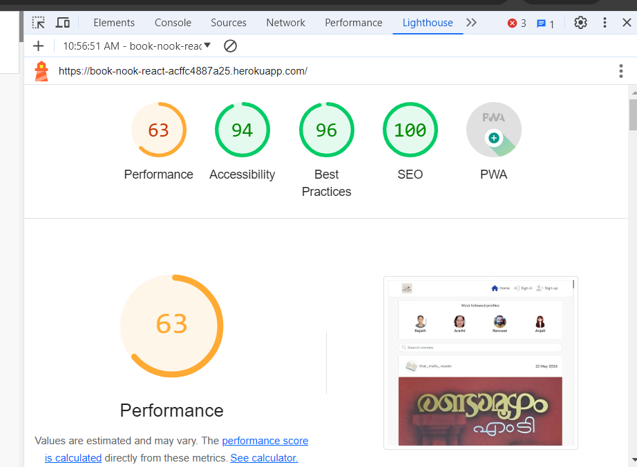

# User Story Testing    

[Link to the detailed document](https://docs.google.com/spreadsheets/d/1Xyv_DZlgVBCaJNJkGRSifHcBmoc2pqo8AT5olc2KZM0/edit#gid=0)     

### Testing (Back-end API)    

    

### Testing (Front-end)     

     

 

# Lighthouse Testing    

Lighthouse testing was performed and the performance score was not that great. Although the other metrics like accessibility, best practices, SEO are high. The main reason for the poor performance is the images used in the website. I tried to change them to Webp but the performance score didn't improve significantly.    

# Responsiveness

All pages were tested to ensure responsiveness on screen sizes from 320px and upwards on Chrome and Edge browsers.
The website is responsive on all screen sizes and no images are pixelated or stretched. No horizontal scroll is present. No elements overlap.
